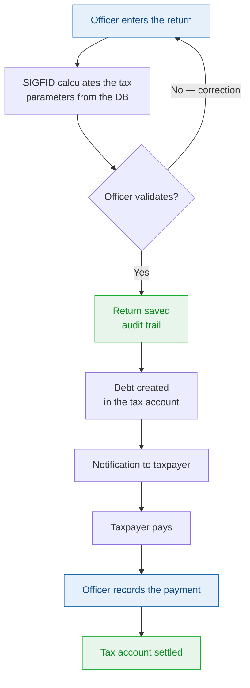

# Tax returns — Overview

SIGFID handles all **return-based taxes** of the Djiboutian tax system. Each tax has its own detailed documentation page.

## Table of covered taxes

| Tax | Code | CGI reference | Deadline | Permission |
|-----|------|---------------|----------|------------|
| [ITS — Wages and Salaries](./its) | ITS | Book 1, Title 1, Ch. 1 — Art. 1-17 | 10th of month M+1 | `DECLARATION_ITS_CREATE` |
| [VAT — Value Added Tax](./tva) | VAT | Book 1, Title 3, Ch. 1 — Art. 171-211 | 20th of month M+1 | `DECLARATION_TVA_CREATE` |
| [IBP / IMF — Business Profits](./ibp-imf) | IBP/IMF | Book 1, Title 1, Ch. 2-3 — Art. 18-62 | 1 April (regular) / 1 February (simplified) | `DECLARATION_IBP_CREATE` |
| [Patentes & Additional Centimes](./patentes) | CP/CA | Book 1, Title 2, Ch. 1-2 — Art. 91-129 | Annual | `DECLARATION_PATENTE_CREATE` |
| [Licence Contribution](./licences) | CL | Book 1, Title 2, Ch. 3 — Art. 130-136 | Annual | `DECLARATION_LICENCE_CREATE` |
| [IRNR — Non-Resident Remuneration](./irnr) | IRNR | Book 1, Title 1, Ch. 5 — Art. 70-77 | 15th of month M+1 | `DECLARATION_IRNR_CREATE` |
| [RAS PS — Services Withholding](./ras-ps) | RAS | Book 1, Title 4, Ch. 4 — Art. 298 | 15th of month M+1 | `DECLARATION_RAS_CREATE` |
| [Other taxes (IIS, IPVI, IPVM, IRVM, TBA)](./autres-impots) | Various | Book 1, Title 1, Ch. 4-9 | Variable | Variable |

---

## Principles common to all returns

### Dynamic rates and brackets

No rate is hard-coded in SIGFID. All tax parameters are configured by the functional administrator in sigfid-console and read dynamically at each calculation.

### Mandatory record-keeping

Each tax calculation is stored in the database with:
- The inputs (tax base, taxpayer data)
- The parameters used at the time of calculation (snapshot)
- The result and the detail of the steps
- The date, the executing officer and the applicable CGI reference

### Mandatory nil return

Even in the absence of transactions, any active taxpayer must file a nil return. SIGFID detects non-filers and generates automatic alerts.

### Automatic penalties

SIGFID automatically calculates and applies penalties (Art. 246-250 CGI) as soon as deadlines are exceeded.

---

## Return processing cycle in SIGFID

